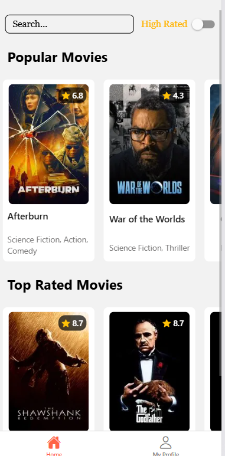
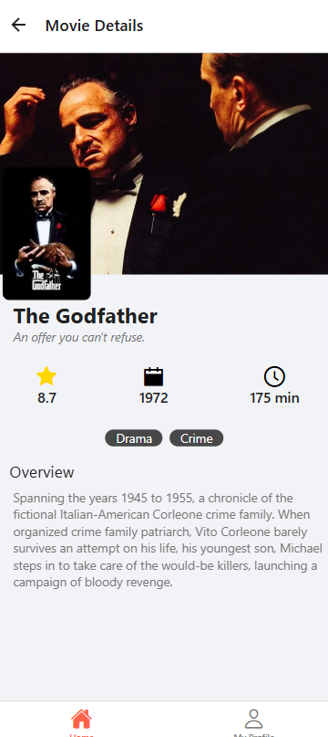

# ReelTime 
## English

[Nederlandse versie](#nederlands)

A modern React Native mobile application for browsing popular and top-rated movies using The Movie Database (TMDb) API. Built with Expo, this app provides an interface to discover movies and view detailed movie information.

## Features

-  Browse popular and top-rated movies
-  Real-time search functionality with debouncing
-  Filter movies by rating (7.0+)
-  Detailed movie information including poster, genres, runtime and release date
-  User profile screen with personal information

## Screenshots





## API Information

This application uses **The Movie Database (TMDb) API** to fetch movie data.

### Endpoints Used:

**List Endpoints:**
- `GET /genre/movie/list` - Fetch all movie genres
- `GET /movie/popular` - Fetch popular movies
- `GET /movie/top_rated` - Fetch top-rated movies

**Detail Endpoint:**
- `GET /movie/{movie_id}` - Fetch detailed information for a specific movie

## Prerequisites

Before running this application, ensure you have the following installed:

- [Node.js](https://nodejs.org/) 
- [npm](https://www.npmjs.com/) 
- A TMDb API key (get one at [https://www.themoviedb.org](https://developer.themoviedb.org/docs/getting-started))
    - For testing **ask me** my personal key!

## Installation & Setup

1. **Clone the repository:**
   ```bash
   git clone https://github.com/Vives-Jonas/ReelTime.git
   cd ReelTime
   ```

2. **Install dependencies:**
   ```bash
   npm install
   ```

3. **Configure environment variables:**
   
   Create a `.env` file in the root directory of the project (use `.env.example` as a template):
   
   ```bash
   EXPO_PUBLIC_API_KEY='put_your_api_key_here'
   EXPO_PUBLIC_API_URL='https://api.themoviedb.org/3'
   ```
   
   ⚠️ **Important:** Replace `put_your_api_key_here` with your actual TMDb API key. The API key will be provided in a separate file.

4. **Start the application:**
   ```bash
   npm start
   ```
  

5. **Run on your device:**
   - Scan the QR code with the Expo Go app (iOS/Android)
   - Press `w` to open in browser

## Search & Filter Logic

### Search Functionality
The search feature implements a **debounced search** mechanism to optimize performance and reduce unnecessary API calls:

- Users can type in the search bar to filter movies by title
- The search has a **500ms delay** (debounce) after the user stops typing before filtering results
- This prevents filtering on every keystroke, improving performance
- The search is **case-insensitive** and matches partial titles

**Technical Implementation:**
```javascript
useEffect(() => {
  const timer = setTimeout(() => {
    setDebouncedSearch(search);
  }, 500);
  
  return () => clearTimeout(timer);
}, [search]);
```

### Filter Logic
The app provides a **rating filter** toggle:

- When enabled, only movies with a rating of **7.0 or higher** are displayed
- The filter can be combined with the search functionality
- Both filters are applied simultaneously using the `applyFilters` function

**Filter Application:**
```javascript
const applyFilters = (movies) => {
  return movies.filter(movie => {
    const matchesSearch = movie.title.toLowerCase().includes(debouncedSearch.toLowerCase());
    const matchesFilter = !filter || movie.vote_average >= 7;
    return matchesSearch && matchesFilter;
  });
};
```

## Project Structure

```
ReelTime/
├── assets/              # Images and static assets
├── components/          # Reusable React components
│   ├── movie/          # Movie-related components
│   ├── profile/        # Profile-related components
│   └── ui/             # UI components (SearchBar, etc.)
├── data/               # API layer and data management
├── screens/            # Main application screens
├── styles/             # Theme and styling
├── App.js              # Main application entry point
└── .env                # Environment variables (not committed)
```

## Technologies Used

- **React Native** - Mobile app framework
- **Expo** - Development platform
- **React Navigation** - Navigation library
- **FlashList** - High-performance list component
- **TMDb API** - Movie database API

## Credits & Resources

### Icons & Images

- **Popcorn.png:** [Cinema icons created by Freepik - Flaticon](https://www.flaticon.com/free-icons/cinema)
- **Movie.png:** [Clapperboard icons created by Freepik - Flaticon](https://www.flaticon.com/free-icons/clapperboard)
- **ReelTime Logo:** [Watching icons created by iconixar - Flaticon](https://www.flaticon.com/free-icons/watching)
- **Avatar:** [Programmer icons created by kliwir art - Flaticon](https://www.flaticon.com/free-icons/programmer)
- **Star:** [Star icons created by Pixel perfect - Flaticon](https://www.flaticon.com/free-icons/star)
- **React Native IonIcons (Antdesign):** [Expo Icons](https://icons.expo.fyi/Index)

### Documentation & Tutorials

- [Customizing TabBar - React Navigation](https://reactnavigation.org/docs/customizing-tabbar/)- 
- [React Native Linking (mailto)](https://reactnative.dev/docs/linking)
- [React Architecture: API Layer](https://profy.dev/article/react-architecture-api-layer-and-fetch-functions#solution-extract-functions-that-connect-to-the-api)
- [How to Create an API Layer with React Hooks](https://dev.to/jeeny/how-to-create-an-api-layer-with-react-hooks-and-typescriptand-why-3a8o)
- [API Layer in React](https://semaphore.io/blog/api-layer-react#what-is-an-api-layer)
- [useNavigation Hook](https://reactnavigation.org/docs/use-navigation/)
- [Navigation Object](https://reactnavigation.org/docs/navigation-object)
- [ActivityIndicator - React Native](https://reactnative.dev/docs/activityindicator)
- [Environment Variables in React Native](https://stackoverflow.com/questions/33117227/setting-environment-variable-in-react-native#answer-43344644)


### Design Inspiration

- [Letterboxd](https://letterboxd.com/film/bring-her-back/)
- [TV Time](https://www.tvtime.com/nl/movie/7e645c16-f873-4365-a602-8f54235094b8)
- [IMDb](https://m.imdb.com/title/tt6304046/)
- [Trackie App](https://raw.githubusercontent.com/etasdemir/Trackie/refs/heads/main/screenshots/home_light.jpg)
- [Simple Profile Screen Examples](https://www.rnexamples.com/react-native-examples/ch/simple-profile-screen-with-invite-buttons-and-user-info)

---

## Nederlands

[English version](#english)

Een moderne React Native mobiele applicatie voor het bekijken van populaire en best beoordeelde films met behulp van The Movie Database (TMDb) API. Gebouwd met Expo. Interface om lijsten van films of gedetailleerde filminformatie te bekijken.

## Functies

-  Bekijk populaire en best beoordeelde films
-  Real-time zoekfunctionaliteit met debouncing
-  Filter films op beoordeling (7.0+)
-  Gedetailleerde filminformatie inclusief poster, genres, speelduur en releasedatum
-  Gebruikersprofielscherm met statische informatie

## Screenshots


## API Informatie

Deze applicatie gebruikt **The Movie Database (TMDb) API** om filmgegevens op te halen.

### Gebruikte Endpoints:

**List Endpoints:**
- `GET /genre/movie/list` - Haal alle filmgenres op
- `GET /movie/popular` - Haal populaire films op
- `GET /movie/top_rated` - Haal best beoordeelde films op

**Detail Endpoint:**
- `GET /movie/{movie_id}` - Haal gedetailleerde informatie op voor een specifieke film

## Vereisten

Voordat je deze applicatie uitvoert, zorg ervoor dat je het volgende hebt geïnstalleerd:

- [Node.js](https://nodejs.org/) 
- [npm](https://www.npmjs.com/)
- Een TMDb API-sleutel (verkrijg er een op [https://www.themoviedb.org](https://developer.themoviedb.org/docs/getting-started))
    - Voor testing **vraag me** mijn persoonlijke key!

## Installatie & Setup

1. **Kloon de repository:**
   ```bash
   git clone https://github.com/Vives-Jonas/ReelTime.git
   cd ReelTime
   ```

2. **Installeer dependencies:**
   ```bash
   npm install
   ```

3. **Configureer omgevingsvariabelen:**
   
   Maak een `.env` bestand aan in de root directory van het project (gebruik `.env.example` als template):
   
   ```bash
   EXPO_PUBLIC_API_KEY='put_your_api_key_here'
   EXPO_PUBLIC_API_URL='https://api.themoviedb.org/3'
   ```
   
   ⚠️ **Belangrijk:** Vervang `put_your_api_key_here` met je daadwerkelijke TMDb API-sleutel. De API-sleutel wordt verstrekt in een apart bestand.

4. **Start de applicatie:**
   ```bash
   npm start
   ```
   

5. **Uitvoeren op je apparaat:**
   - Scan de QR-code met de Expo Go app (iOS/Android)
   - Druk op `w` om te openen in browser

## Zoek- & Filterlogica

### Zoekfunctionaliteit
De zoekfunctie implementeert een **debounced search** mechanisme om de prestaties te optimaliseren en onnodige API-aanroepen te verminderen:

- Gebruikers kunnen in de zoekbalk typen om films op titel te filteren
- De zoekopdracht heeft een **500ms vertraging** (debounce) nadat de gebruiker stopt met typen voordat resultaten worden gefilterd
- Dit voorkomt filtering bij elke toetsaanslag, wat de prestaties verbetert
- De zoekopdracht is **hoofdletterongevoelig** en matcht gedeeltelijke titels

**Technische Implementatie:**
```javascript
useEffect(() => {
  const timer = setTimeout(() => {
    setDebouncedSearch(search);
  }, 500);
  
  return () => clearTimeout(timer);
}, [search]);
```

### Filterlogica
De app biedt een **beoordelingsfilter** toggle:

- Wanneer ingeschakeld, worden alleen films met een beoordeling van **7.0 of hoger** weergegeven
- Het filter kan worden gecombineerd met de zoekfunctionaliteit
- Beide filters worden tegelijkertijd toegepast met behulp van de `applyFilters` functie

**Filter Toepassing:**
```javascript
const applyFilters = (movies) => {
  return movies.filter(movie => {
    const matchesSearch = movie.title.toLowerCase().includes(debouncedSearch.toLowerCase());
    const matchesFilter = !filter || movie.vote_average >= 7;
    return matchesSearch && matchesFilter;
  });
};
```

## Projectstructuur

```
ReelTime/
├── assets/              # Afbeeldingen en statische assets
├── components/          # Herbruikbare React componenten
│   ├── movie/          # Film-gerelateerde componenten
│   ├── profile/        # Profiel-gerelateerde componenten
│   └── ui/             # UI componenten (SearchBar, etc.)
├── data/               # API laag en data management
├── screens/            # Hoofdschermen van de applicatie
├── styles/             # Thema en styling
├── App.js              # Hoofdingang van de applicatie
└── .env                # Omgevingsvariabelen (niet gecommit)
```

## Gebruikte Technologieën

- **React Native** - Mobiele app framework
- **Expo** - Ontwikkelplatform
- **React Navigation** - Navigatiebibliotheek
- **FlashList** - Hoogperformante lijst component
- **TMDb API** - Filmdatabase API

## Credits & Bronnen

### Iconen & Afbeeldingen

- **Popcorn.png:** [Cinema icons created by Freepik - Flaticon](https://www.flaticon.com/free-icons/cinema)
- **Movie.png:** [Clapperboard icons created by Freepik - Flaticon](https://www.flaticon.com/free-icons/clapperboard)
- **ReelTime Logo:** [Watching icons created by iconixar - Flaticon](https://www.flaticon.com/free-icons/watching)
- **Avatar:** [Programmer icons created by kliwir art - Flaticon](https://www.flaticon.com/free-icons/programmer)
- **Star:** [Star icons created by Pixel perfect - Flaticon](https://www.flaticon.com/free-icons/star)
- **React Native IonIcons (Antdesign):** [Expo Icons](https://icons.expo.fyi/Index)

### Documentatie & Tutorials

- [Customizing TabBar - React Navigation](https://reactnavigation.org/docs/customizing-tabbar/)- 
- [React Native Linking (mailto)](https://reactnative.dev/docs/linking)
- [React Architecture: API Layer](https://profy.dev/article/react-architecture-api-layer-and-fetch-functions#solution-extract-functions-that-connect-to-the-api)
- [How to Create an API Layer with React Hooks](https://dev.to/jeeny/how-to-create-an-api-layer-with-react-hooks-and-typescriptand-why-3a8o)
- [API Layer in React](https://semaphore.io/blog/api-layer-react#what-is-an-api-layer)
- [useNavigation Hook](https://reactnavigation.org/docs/use-navigation/)
- [Navigation Object](https://reactnavigation.org/docs/navigation-object)
- [ActivityIndicator - React Native](https://reactnative.dev/docs/activityindicator)
- [Environment Variables in React Native](https://stackoverflow.com/questions/33117227/setting-environment-variable-in-react-native#answer-43344644)

### Ontwerpinspiratie

- [Letterboxd](https://letterboxd.com/film/bring-her-back/)
- [TV Time](https://www.tvtime.com/nl/movie/7e645c16-f873-4365-a602-8f54235094b8)
- [IMDb](https://m.imdb.com/title/tt6304046/)
- [Trackie App](https://raw.githubusercontent.com/etasdemir/Trackie/refs/heads/main/screenshots/home_light.jpg)
- [Simple Profile Screen Examples](https://www.rnexamples.com/react-native-examples/ch/simple-profile-screen-with-invite-buttons-and-user-info)